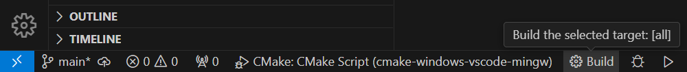
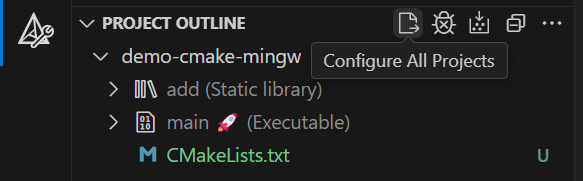
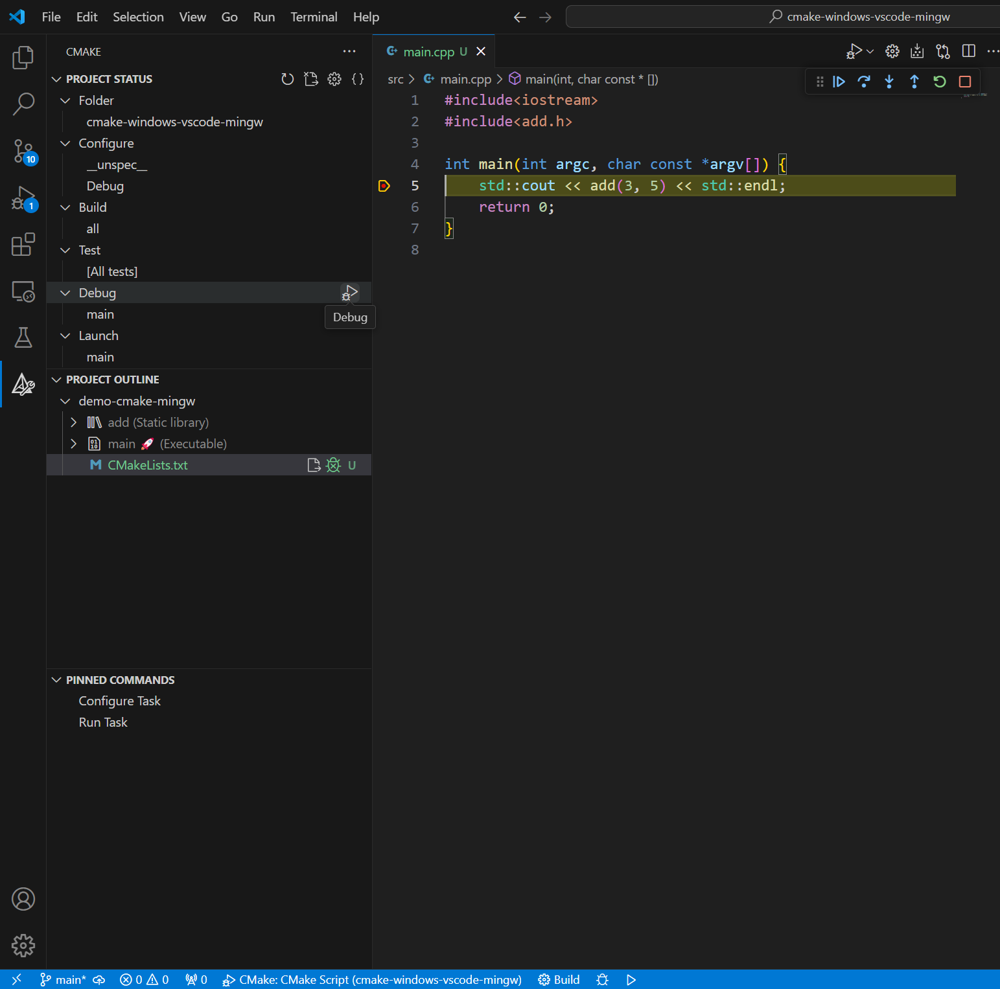
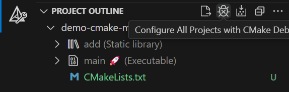
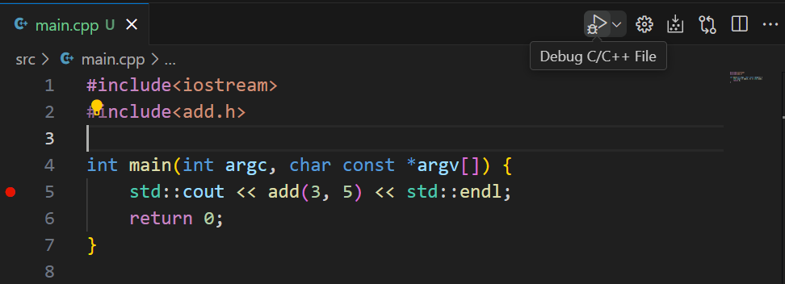

这是一个cmake使用demo，说明在Windows下，IDE使用VSCode，编译器使用MinGW，如何运行并调试cmake项目。

[参考](https://github.com/y805939188/how-to-use-cmake-in-vscode)

## VSCode所需插件
除了cpp的插件，还需要CMake和CMake Tools这两个插件

## cmake的生成与构建
首先，`mkdir build`并`cd build`，后续产物放在这里。

### 使用命令行

生成：

`build> cmake -G "MinGW Makefiles" ..`

由于想在Windows下使用MinGw作为编译器，所以要用-G参数指定生成器为MinGW。否则cmake会去用MSVC作为生成器。

构建：

`build> cmake --build . --config Debug`

由于是想要debug，所以以debug模式进行构建，运行之后在build文件夹下会有main.exe。

### 使用VSCode的UI构建
在.vscode中设置好相关属性，这里已经放了.vscode文件夹，但是里面MinGW的编译器的路径需要自行更改。

点击下方的build按钮即可通过VSCode进行构建

也可以点以下图中的第一个(Configure All Projects)和第三个图标(Build All Projects)，分别进行cmake生成与构建。效果和点build按钮一样。

## VSCode调试cmake项目

打好断点，在cmake插件的标签页里，点击Debug的图标即可debug

如果是命令行手动构建的，需要点下Configure All Projects with CMake Debugger按钮。

注意由于是cmake项目，不能用右上角的那个Debug C/C++ File来运行，点那个按钮是针对main.cpp进行编译运行。

错误操作:

